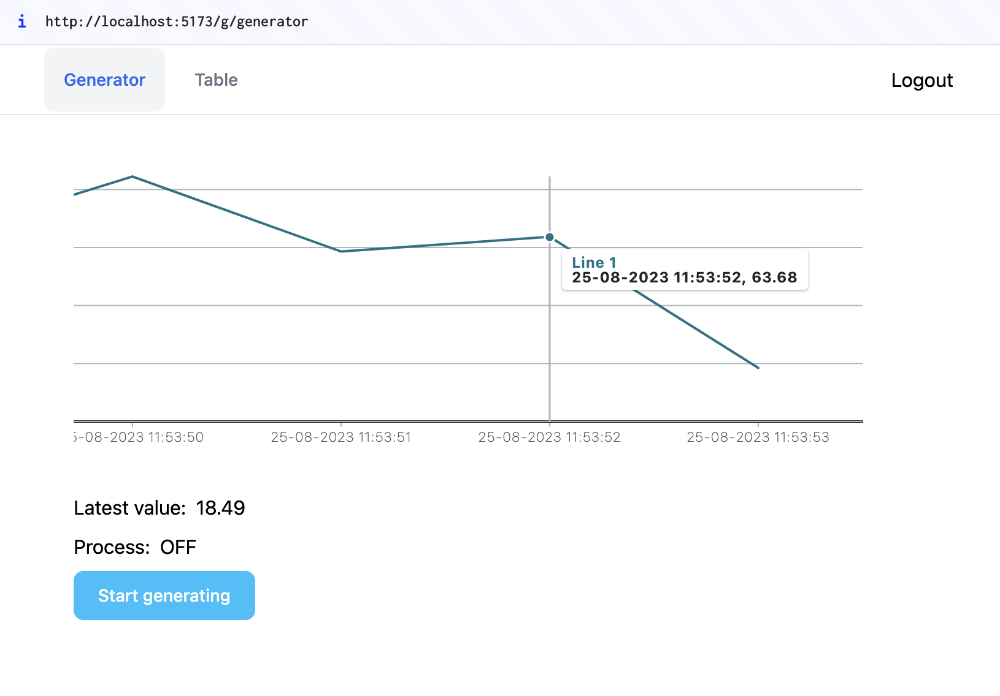
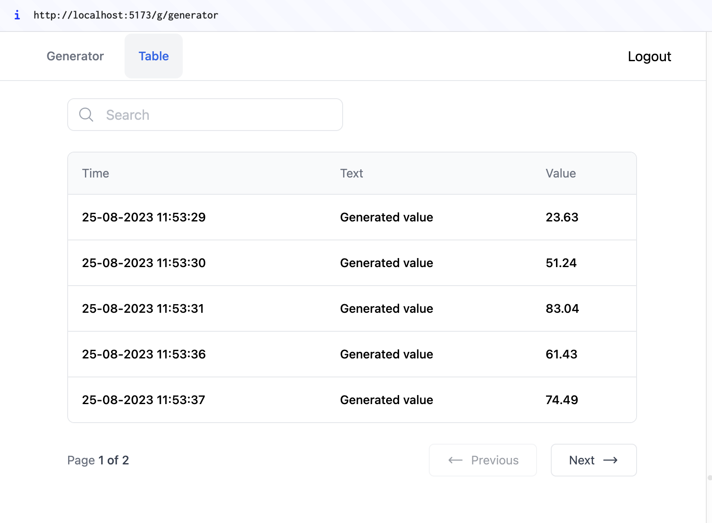

## Task

Create a simple React application that generates random values every 15 seconds and displays them in a graph and table (use redux to store the values), along with the time they were generated. The project should also include login and registration with basic form validation.

Total time spent on the project: 17h (approx 2 man-days)

## Timeline

v0.1

- complete main task parts (16h)
  - create login/register pages [x]
  - simulate "authenticated" access to pages [x]
  - generate random values and save them to redux store [x]
  - create graph & table to represent values [x]

to be done:  
v0.1-min-bundle

- create branch with these lib replaced:
  - redux -> legen-state
  - visx -> react-frappe-charts/frappe-charts
  - zod -> superstruct
  - react spring -> legend-motion
  - (update) react table -> tanstack table 

## App

Generator page:



Table:



## Setup

ask for the API token and create .env file inside project root directory and set `VITE_TOKEN='***'` variable with this token

install dependences:

```bash
npm i
```

run application on localhost:

```bash
npm run dev
```

### Deployed app  
you can use these credentials:  

email: asd@asd.com  
passwd: asdasd

or set 'authorized' localstorage variable to 'true'  
(e.g. authorized:	true)

### Libraries

- [React 18](https://reactjs.org/)
- [React Router 6](https://reactrouter.com)
- [tailwindcss 3](https://tailwindcss.com/)
  - [tailwindcss forms plugin](https://tailwindcss-forms.vercel.app/)
- [TypeScript 4.9.5](https://www.typescriptlang.org/)
- [vite 4](https://vitejs.dev/)
- redux
- visx
- react-hook-form
- zod
- react-spring

